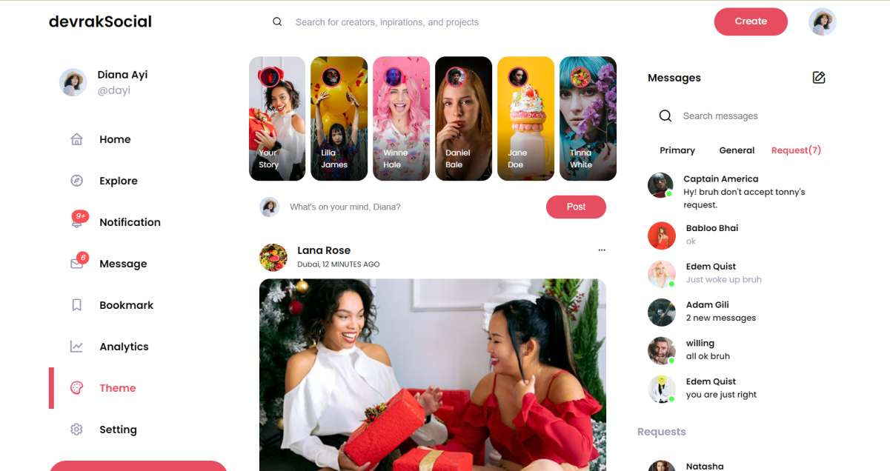
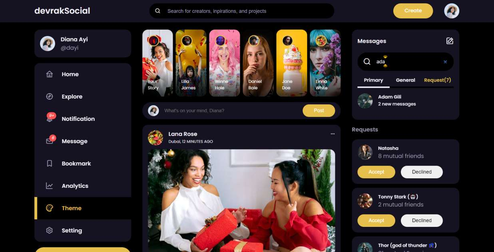
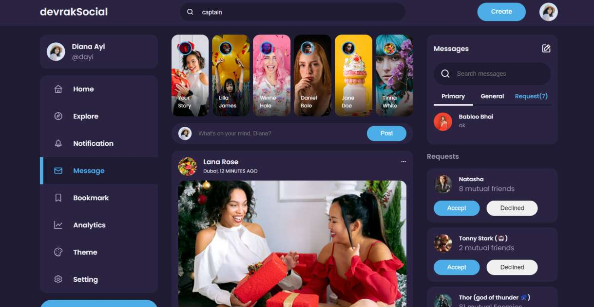

# :closed_book: dev-rak Social Media App

### _Social Media Clone app usin !!_

### Link :link: https://dev-rak-social.netlify.app/

## Interface

## Run Locally

  - Run This command `https://github.com/developer-rak/devrak-social-media-web.git`
  - You are now in the dev environment and you can play around
  - Open Source (Tweak it and use it)
    
## ✨ Features
  - Light Mode
  - dark Mode
  - filter out chats
  - customize themes
  - notifications
  - messages
    
## ⚙️ Tech Stack
  - HTML5
  - Css
  - JavaScript
  - Netlify
